<h1 align="center">가이드라인 개요</h1>

## 1.1. 가이드라인 최종 목표

이 가이드를 숙지함으로써 공급자는 AICON 플랫폼과 원활하게 연동하기 위해 반드시 구현 및 연동해야 하는 다양한 모델 등록 타입과 주요 API(Record Usage, Check Alive, Get Usage For Settlement)에 대한 요건을 정확히 이해할 수 있습니다.

이를 통해 모델의 서비스 모니터링, 사용 이력 기록, 비용 정산 등 전체 연동 과정을 효율적으로 관리함으로써  
- 안정적이고 신속하게 모델을 등록 및 운영할 수 있고  
- 필수 API를 정확한 사양에 맞게 개발·연동할 수 있으며  
- 사용자 이용 이력 관리 및 정산 프로세스를 투명하게 수행할 수 있습니다.

---

## 1.2. 모델 등록 타입 설명

1. **Type 1 – AICON Hosted FE**  
   Provider가 직접 개발하거나 AICON에서 제공하는 샘플 소스를 활용하여 빌드한 프론트엔드 소스를 AICON에 업로드합니다. 해당 마이크로사이트는 AICON 인프라에 배포되며, 외부에 있는 Model의 백엔드와 연동합니다.

2. **Type 2 – AICON Microsite**  
   Provider는 AICON에서 제공하는 기본 마이크로사이트 UI를 사용합니다.  
   a. **Chatting Type**: 실시간 채팅 UI를 통해 Model과 상호작용할 수 있습니다.  
   b. **Multi Input Type**: 파일(img, csv, txt, pdf 등) 업로드 및 결과와 파일 다운로드 기능을 제공합니다.

3. **Type 3 – Model with OAuth or API Key**  
   Provider가 자체적으로 사용자 인터페이스(Microsite)를 개발 및 운영합니다. AICON과는 OAuth 또는 API Key 방식으로 인증과 연동을 진행합니다.

4. **Type 4 – Outlink**  
   Provider가 자체적으로 UI를 구축하여 독립적으로 운영합니다. OAuth 방식으로 인증하며, 서비스는 별도로 제공합니다.

---

## 1.3. 준비 필요 있는 API 설명

1. **API Record Usage**  
   이 API는 AICON에서 개발하며, Provider는 사용자가 Model을 이용할 때마다 해당 사용 이력을 AICON에 전송하도록 이 API를 반드시 연동해야 합니다.  
   **API Format:** [/api/Provider/record-usage](https://api.aicon.or.kr/swagger/index.html)  
   **API Design:** [API Design Record Usage](https://docs.google.com/spreadsheets/d/1GB-fm4F-AjZxavDDTdJJ2j-DbilcBPixCLgoX-2bcIg/edit?gid=506055246#gid=506055246)  

2. **API Check Alive**  
   이 API는 Provider가 AICON에서 제공하는 설계 및 포맷에 따라 개발합니다. 사용자가 Model 상세 페이지에서 "Run Model" 버튼을 클릭하면, AICON이 이 API를 호출하여 Model이 정상적으로 운영 중인지 확인합니다.  
   **API Format:** [/api/Provider/is-alive](https://api.aicon.or.kr/swagger/index.html)  
   **API Design:** [API Design Check Alive](https://docs.google.com/spreadsheets/d/1GB-fm4F-AjZxavDDTdJJ2j-DbilcBPixCLgoX-2bcIg/edit?gid=281968065#gid=281968065)  

3. **API Get Usage For Settlement**  
   이 API는 Provider가 AICON에서 제공하는 설계 및 포맷에 따라 개발합니다. 매월 정산 시점에 AICON이 해당 API를 호출하면, Provider는 월간 사용자별 Model 사용 이력을 AICON에 전달합니다. AICON은 이 API와 API Record Usage를 토대로 사용자 이용 요금을 산정합니다.  
   **API Format:** [/api/Provider/get-usage-for-settlement](https://api.aicon.or.kr/swagger/index.html)  
   **API Design:** [API Design Get Usage For Settlement](https://docs.google.com/spreadsheets/d/1GB-fm4F-AjZxavDDTdJJ2j-DbilcBPixCLgoX-2bcIg/edit?gid=543050747#gid=543050747)  


## STEP-01

<table>
<tr>
<td width="70%">

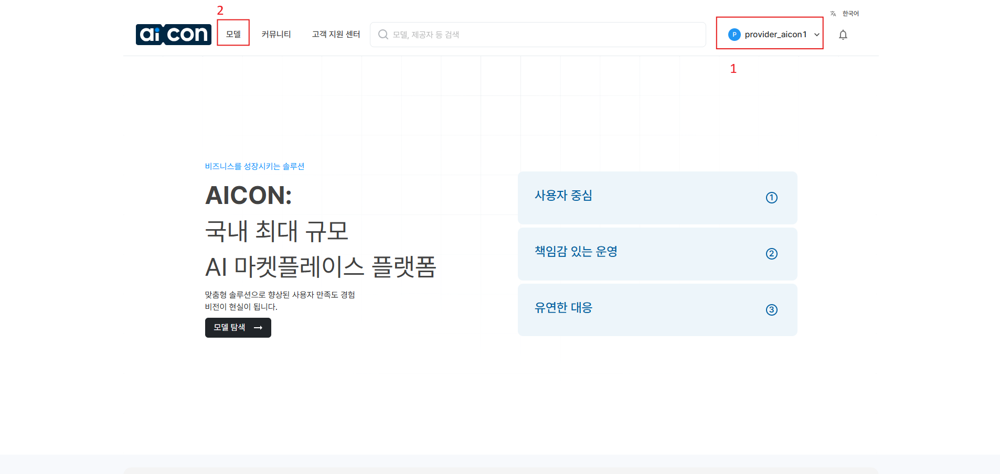
</td>
<td width="30%" valign="top" style="background-color:#f2f2f2; padding:15px; border-radius:10px;">
   
**STEP-01**  

1. 프로바이더로 **‘로그인’** 한 후  
2. 상단 메뉴 바의 **‘모델’** 버튼을 클릭합니다  

</td>
</tr>
</table>

## STEP-02

<table>
<tr>
<td width="70%">

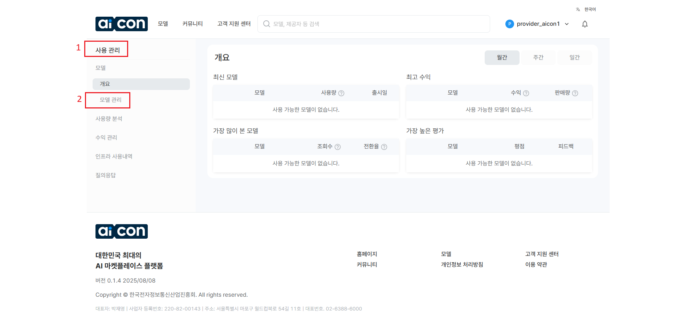
</td>
<td width="30%" valign="top" style="background-color:#f2f2f2; padding:15px; border-radius:10px;">
   
**STEP-02**  

1. 왼쪽 메뉴 바의 **‘사용 관리’** 에서  
2. **‘모델 관리’** 메뉴를 선택합니다.  

</td>
</tr>
</table>

## STEP-03

<table>
<tr>
<td width="70%">

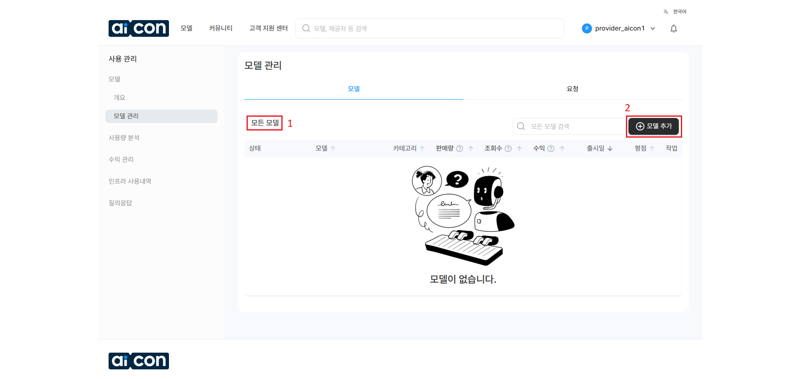
</td>
<td width="30%" valign="top" style="background-color:#f2f2f2; padding:15px; border-radius:10px;">
   
**STEP-03**  

1. **‘모델 관리’** 화면에서 에서  
2. **‘모델 추가’** 버튼을 클릭합니다.  

</td>
</tr>
</table>

## STEP-04

<table>
<tr>
<td width="70%">

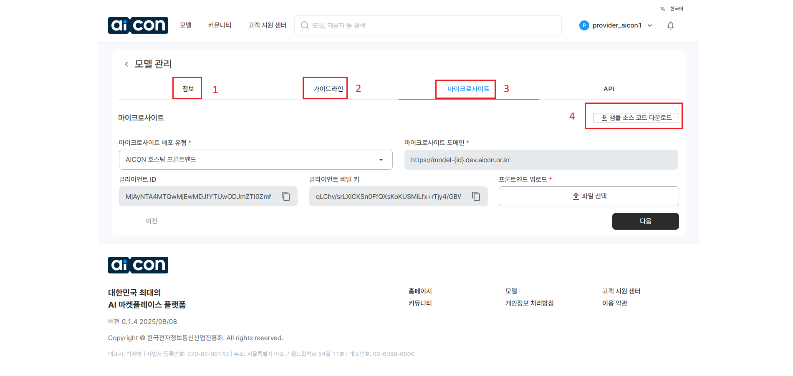
</td>
<td width="30%" valign="top" style="background-color:#f2f2f2; padding:15px; border-radius:10px;">
   
**STEP-04**  

1. 순서대로 모델 ‘정보’ 입력 <span style="color:red">(*필수)</span>  
2. 모델 **‘가이드라인’** 정보 입력 <span style="color:red">(*선택)</span>
3. **‘마이크로사이트 배포 유형’** 및 구성 정보를 선택합니다.
4. 모델의 **샘플 소스 코드 다운로드** - Blazor 및 Angular <span style="color:red"> (*Type 1에만 한함) </span>

</td>
</tr>
</table>

## Blazor 소스 코드 구조

<table>
<tr>
<td width="30%">

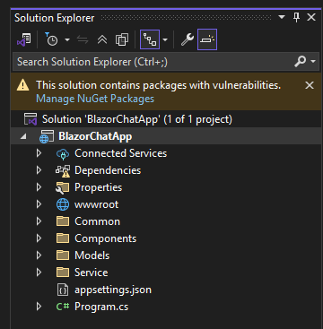
</td>
<td width="70%" valign="top" style="background-color:#f2f2f2; padding:15px; border-radius:10px;">
   
**Blazor 소스 코드 구조**  

1. **Connected Services:** 외부 서비스 추가 위치 (예: Azure Storage, WCF, gRPC 등)

2. **Dependencies**  
   a. **Analyzers**: 컴파일 과정에서 코드 자동 검사 도구 저장 위치  
   b. **Framework**: 사용 중인 .NET 프레임워크 정보 (프로젝트가 실행되는 플랫폼)  
   c. **Packages**: 코드 작성 시 추가한 NuGet 패키지 저장 위치  
   d. **Properties**: 애플리케이션 실행 시 설정(툴, URL, 실행 환경 등)

3. **wwwroot**  
   a. **images**: 프로젝트 내 이미지 파일 저장 위치  
   b. **js**: Blazor에서 JS interop을 통해 호출하는 JavaScript 파일 저장 위치  
   c. **app.css**: 애플리케이션 전체 스타일을 위한 CSS 파일

4. **Common:** 프로젝트 전반에서 공통으로 사용하는 클래스 및 함수 파일

5. **Components:** UI 코드 파일 저장 위치

6. **Models:** 데이터 구조를 설명하는 클래스 파일 저장 위치

7. **Service:** 비즈니스 로직 처리 및 API 호출을 담당하는 서비스 로직 파일 저장 위치

8. **.gitignore:** Git에서 소스 관리 제외할 파일 및 폴더 지정 파일

9. **appsettings.json:** 애플리케이션 주요 설정 파일로, API URL, API Key, ClientID, Client Secret 등을 저장

10. **Program.cs**  
    Blazor Server 애플리케이션의 시작점  
    a. 웹 호스트 생성 및 설정  
    b. 필요한 서비스 등록(DI)  
    c. 미들웨어 및 라우팅 설정  
    d. 애플리케이션 실행
      
이 구조를 참고하시면 Blazor 프로젝트의 전체적인 구성과 역할을 이해하는 데 도움이 될 것입니다.  
</td>
</tr>
</table>

## Angular 소스 코드 구조

<table>
<tr>
<td width="30%">

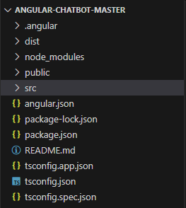
</td>
<td width="70%" valign="top" style="background-color:#f2f2f2; padding:15px; border-radius:10px;">
   
**Angular 소스 코드 구조**  

1. **public**: 이미지, favicon, JSON 파일, HTML, CSS, JS 등 빌드 도구의 처리 없이 사용하는 정적 파일 저장 위  
2. **src**: 메인 소스 코드가 위치한 폴더  
3. **app**: 주요 소스 코드 폴더  
   a. **core**: 애플리케이션의 공통 로직 및 핵심 기능 저장  
   b. **dto**: 데이터 타입 선언 저장  
   c. **layout**: 애플리케이션 레이아웃 및 UI 구성  
   d. **pages**: 애플리케이션 내 개별 페이지  
   e. **services**: 비즈니스 로직 및 API 호출 처리  
4. **assets**: 이미지, 폰트, JSON 등 컴파일 없이 직접 사용하는 정적 자원 저장  
   a. **configs**: 애플리케이션의 주요 설정 파일(API URL, API Key, ClientID, Client Secret 등)  
   b. **image**: 애플리케이션 내 이미지 저장  
5. **favicon.ico**: 웹사이트 아이콘 파일(브라우저 탭 및 즐겨찾기 표시)  
6. **index.html**: Angular 애플리케이션의 진입점 HTML 파일  
7. **main.ts**: 애플리케이션을 시작하는 TypeScript 파일  
8. **styles.scss**: 애플리케이션 전역 스타일 시트  
9. **Web.config**: IIS 서버용 설정 파일  
10. **.gitignore**: Git 커밋 시 제외할 파일 및 폴더 지정
      
기타 파일들은 프로젝트 초기화 시 기본 생성되는 파일들입니다. 이 구조를 참고하시면 Angular 프로젝트의 전반적인 구성과 역할을 이해하는 데 도움이 될 것입니다.  
</td>
</tr>
</table>

## [공통] 타입 1 - 4

<table>
<tr>
<td width="60%">

API Format: [/api/Provider/record-usage](https://dev-api.aicon.or.kr/swagger/index.html)  
API Design: [API Design Record Usage](https://docs.google.com/spreadsheets/d/1GB-fm4F-AjZxavDDTdJJ2j-DbilcBPixCLgoX-2bcIg/edit?gid=506055246#gid=506055246)  

</td>
<td width="40%" valign="top" style="background-color:#f2f2f2; padding:15px; border-radius:10px;">
   
**[공통] 타입 1 - 4**  

프로바이더는 반드시 AICON에서 개발한 **Record Usage API(사용내역 기록)** 를 사용자가 모델을 사용할때마다 호출해야 하며, 자사 AI 모델과 연동하는 책임이 있습니다. 해당 API의 주요 목적은 다음과 같습니다:  
1. 프로바이더는 사용자의 모델 사용 내역을 사용 단위별로 AICON에 전달합니다.  
2. 사용자는 이 API를 통해 본인의 사용 비용을 실시간으로 확인할 수 있습니다.  
3. 또한, **record-usage API** 와 **get-usage-for-settlement API**는 모델 사용료 정산에 사용 됩니다  
</td>
</tr>
</table>

<h1 align="center">TYPE 1 AICON 호스팅 프론트엔드</h1>  

## STEP-05

<table>
<tr>
<td width="70%">

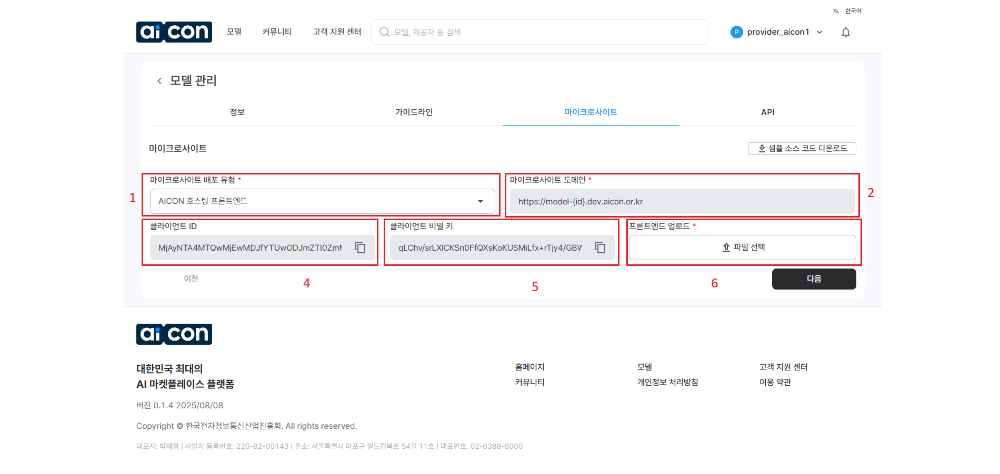 

</td>
<td width="30%" valign="top" style="background-color:#f2f2f2; padding:15px; border-radius:10px;">
   
**STEP-05**  

1. **‘마이크로사이트 배포 유형’** 드롭다운 메뉴에서 **‘AICON 호스팅 프론트엔드’** 를 선택합니다.

2. 등록이 성공하면 **‘마이크로사이트 도메인’** 형식이 표시됩니다.

3. **클라이언트 ID:** 등록된 모델의 OAuth 인증 방식을 설정하는 데 사용됩니다.

4. **클라이언트 비밀 키:** 등록된 모델의 OAuth 인증 방식을 설정하는 데 사용됩니다.

5. **프론트엔드 업로드:** 프로바이더가 빌드한 파일을 업로드합니다. 
</td>
</tr>
</table>

## STEP-06-1

<table>
<tr>
<td width="60%">

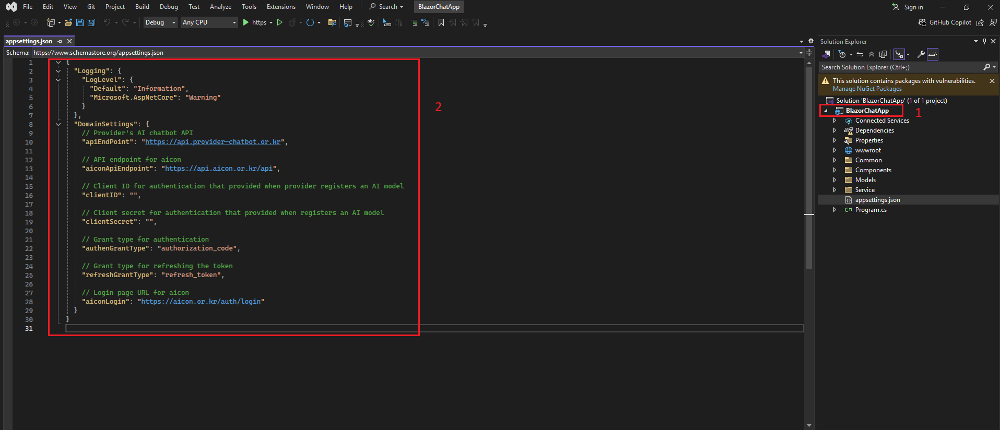 

</td>
<td width="40%" valign="top" style="background-color:#f2f2f2; padding:15px; border-radius:10px;">
   
**STEP-06-1**  
**Blazor 샘플 소스 코드 설정**  

1. 다음 경로로 접근합니다: blazor-chatbot\appsettings.json  

2. 해당 소스 코드 설정을 귀하의 모델에 맞게 변경합니다.  
  
// Provider's AI chatbot API  
apiEndPoint: "",  
// API endpoint for AICON  
aiConApiEndpoint: "https://api.aicon.or.kr/api",  
// Client ID for authentication that provided when provider registers an AI model  
clientID: "", // from S-05  
// Client secret for authentication that provided when registers an AI model  
clientSecret: "", // from S-05  
// Grant type for authentication  
authenGrantType: "authorization_code",  
// Grant type for refreshing the token  
refreshGrantType: "refresh_token",  
// Login page URL for AICON  
aiConLogin: "https://aicon.or.kr/auth/login"  

</td>
</tr>
</table>

<table>
<tr>
<td width="60%">

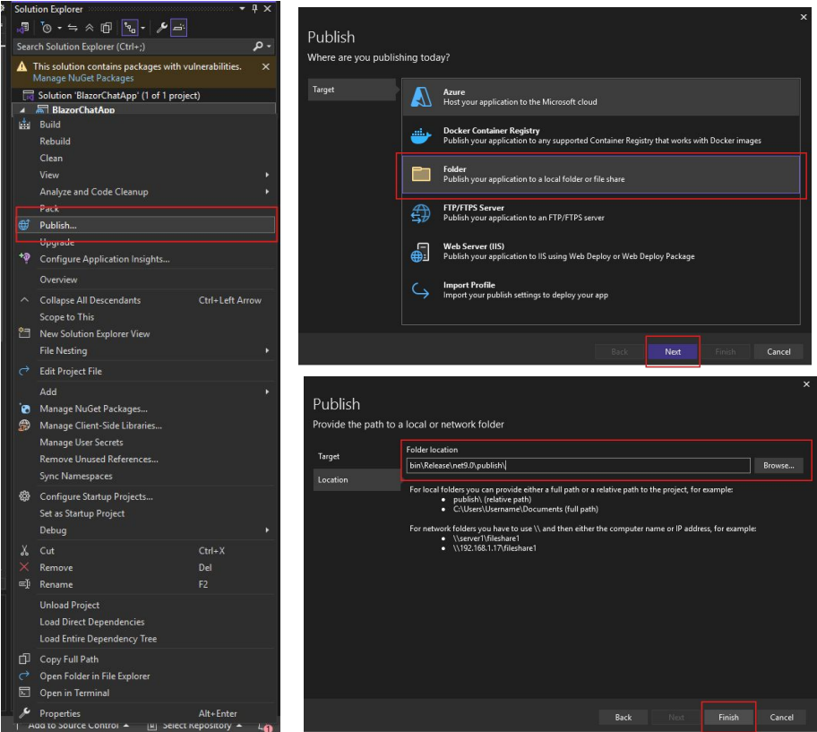 

</td>
<td width="40%" valign="top" style="background-color:#f2f2f2; padding:15px; border-radius:10px;">
   
**STEP-06-2**  
**Blazor 샘플 소스 코드  게시**  

1. 설정 구성 후, Blazor 소스 코드를 게시합니다. 

2. Publish 버튼을 클릭하고, 타겟으로 Folder를 선택한 다음 게시할 대상 폴더를 선택합니다.

</td>
</tr>
</table>

<table>
<tr>
<td width="60%">

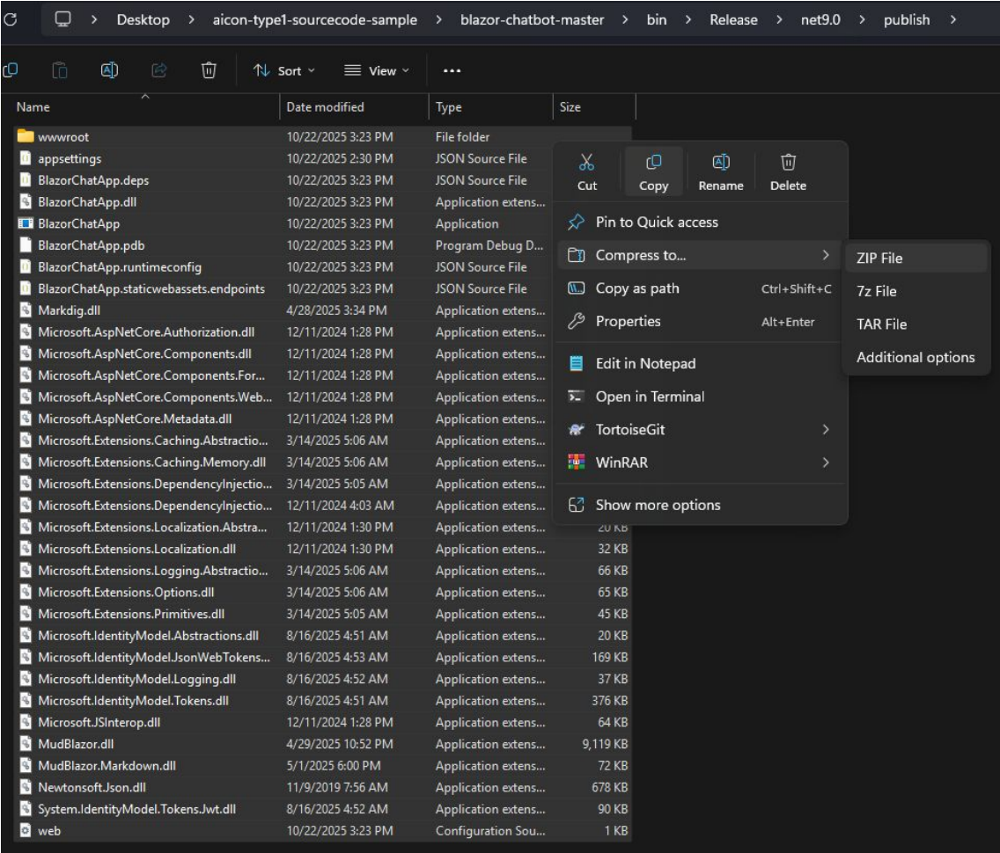 

</td>
<td width="40%" valign="top" style="background-color:#f2f2f2; padding:15px; border-radius:10px;">
   
**STEP-06-3**  
**Blazor 샘플 소스 코드 게시 및 압축**  

1. 'Ready to publish' 메시지가 나타나면 Publish 버튼을 클릭합니다.  

2. 게시 프로세스가 완료되면 aicon-type1-sourcecode-sample\blazor-chatbot-master\bin\Release\net9.0\publish로 이동하여 publish 폴더의 모든 파일을 ZIP 파일로 압축합니다.

3. 압축 후 ZIP 파일을 AICON에 업로드합니다.
</td>
</tr>
</table>

## Example Config File Blazor:  

```json
{
  "Logging": {
    "LogLevel": {
      "Default": "Information",
      "Microsoft.AspNetCore": "Warning"
    }
  },
  "DomainSettings": {
    "apiEndPoint": "https://api-pro-kab-chatbot.ominext.dev",
    "aiconApiEndpoint": "https://api.aicon.or.kr/api",
    "clientID": "MjAyNTA3MTExMDA4MzhfZTI4NWQ2NDllZjc2NDQxZjg4MWQzYTFhNTAwMmZiMDA=",
    "clientSecret": "pMrZJAJc31+RdcbNAKPtHusiba2RggVTYI+aRkm1AlF6XqQrJ90f6adPu+bAYvR4",
    "authenGrantType": "authorization_code",
    "refreshGrantType": "refresh_token",
    "aiconLogin": "https://aicon.or.kr/auth/login"
  }
}

```

**Blazor 소스 코드 빌드하기**  

<h2 align="center"><a href="https://www.youtube.com/watch?v=WLASXqxzXj4">📺 TYPE 1-1 - VIDEO GUIDE (for Blazor)</a></h2>

## STEP-07-1

<table>
<tr>
<td width="60%">

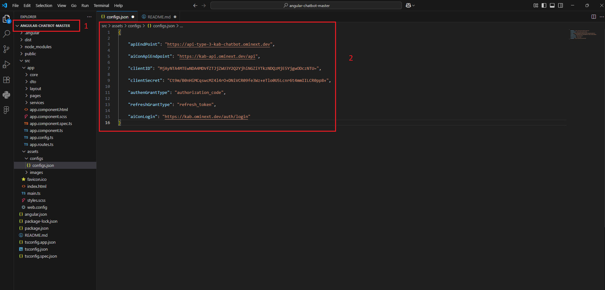 

</td>
<td width="40%" valign="top" style="background-color:#f2f2f2; padding:15px; border-radius:10px;">
   
**STEP-07-1**  
**Config Angular Sample Source Code**  

1. 다음 파일 경로에 접근합니다: \angular-chatbot\src\assets\configs\configs.json  

2. 모델과 호환되도록 소스 코드 구성을 변경합니다.
 
</td>
</tr>
</table>

<table>
<tr>
<td width="60%">

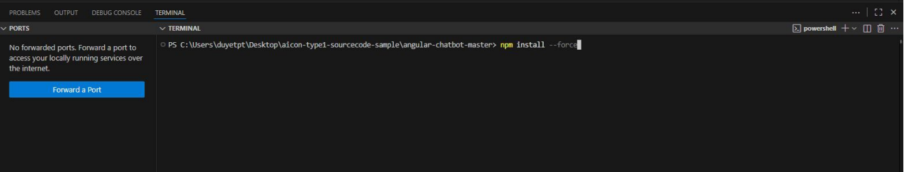  
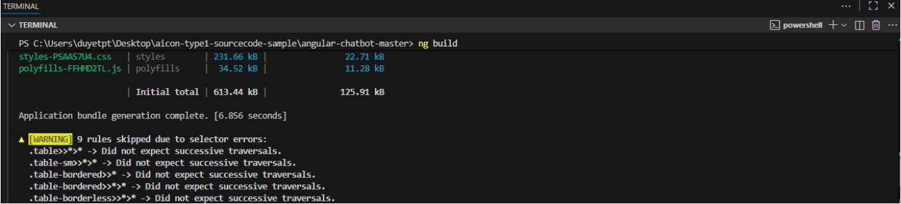

</td>
<td width="40%" valign="top" style="background-color:#f2f2f2; padding:15px; border-radius:10px;">
   
**STEP-07-2**  
**Angular 샘플 소스 코드 설치 및 빌드**  

소스 코드의 패키지 설치: IDE 터미널을 열고 npm install --force 명령어를 실행하여 프로젝트 의존성을 설치합니다.  

패키지 설치 후, IDE 터미널에서 "ng build" 명령어를 실행하여 소스 코드를 빌드합니다.
 
</td>
</tr>
</table>

<table>
<tr>
<td width="60%">

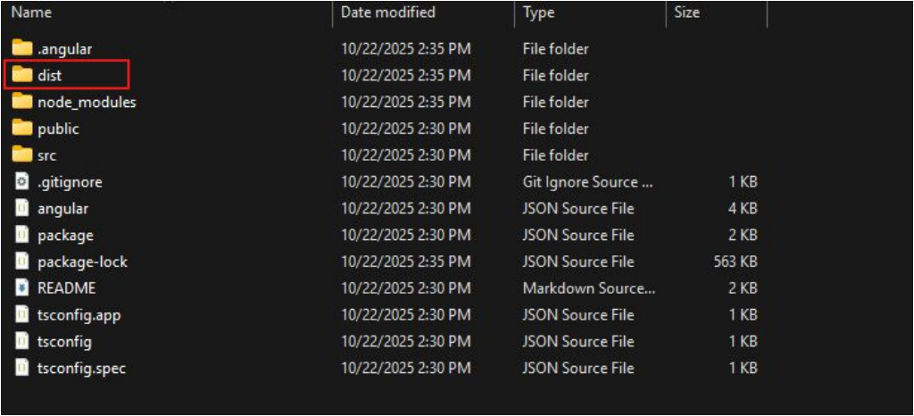  
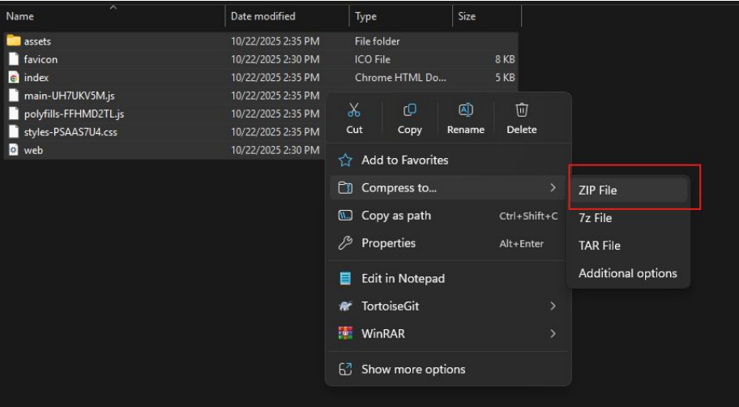

</td>
<td width="40%" valign="top" style="background-color:#f2f2f2; padding:15px; border-radius:10px;">
   
**STEP-07-3**  
**파일 압축 및 업로드**  

1. 빌드가 완료되면 Dist > ai-chatbot > browser 디렉토리로 이동합니다.  

2. browser 폴더의 모든 내용을 ZIP 파일로 압축합니다.

3. 압축된 파일을 AICON에 업로드합니다.
 
</td>
</tr>
</table>

## Example Config File:

```json
{
    "apiEndPoint": "https://api-pro-kab-chatbot.ominext.dev",
    "aiConApiEndpoint": "https://api.aicon.or.kr/api",
    "clientID": "",
    "clientSecret": "",
    "authenGrantType": "authorization_code",
    "refreshGrantType": "refresh_token",
    "aiConLogin": "https://aicon.or.kr/auth/login"
}
```

**Angular 소스 코드 빌드하기**  

<h2 align="center"><a href="https://www.youtube.com/watch?v=7SLnUSaX3GA">📺 TYPE 1-2 - VIDEO GUIDE (for Angular)</a></h2> 

## STEP-08

<table>
<tr>
<td width="60%">

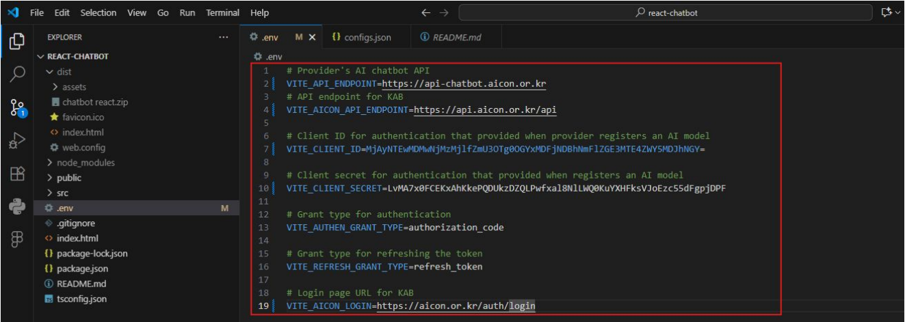 

</td>
<td width="40%" valign="top" style="background-color:#f2f2f2; padding:15px; border-radius:10px;">
   
**STEP-08-1**  
**React 샘플 소스 코드 구성**  

1. 다음 파일 경로에 접근합니다: \react-chatbot\.env  

2. 모델과 호환되도록 소스 코드 구성을 변경합니다.
 
</td>
</tr>
</table>

<table>
<tr>
<td width="60%">

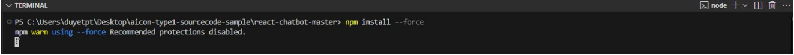  
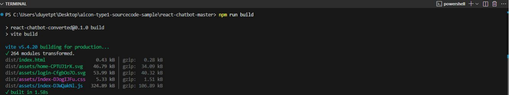

</td>
<td width="40%" valign="top" style="background-color:#f2f2f2; padding:15px; border-radius:10px;">
   
**STEP-08-2**  
**React 샘플 소스 코드 설치 및 빌드**  

1. 소스 코드의 패키지 설치: IDE 터미널을 열고 npm install --force 명령어를 실행하여 프로젝트 의존성을 설치합니다.  

2. 패키지 설치 후, IDE 터미널에서 "npm run build" 명령어를 실행하여 소스 코드를 빌드합니다.
 
</td>
</tr>
</table>

<table>
<tr>
<td width="60%">

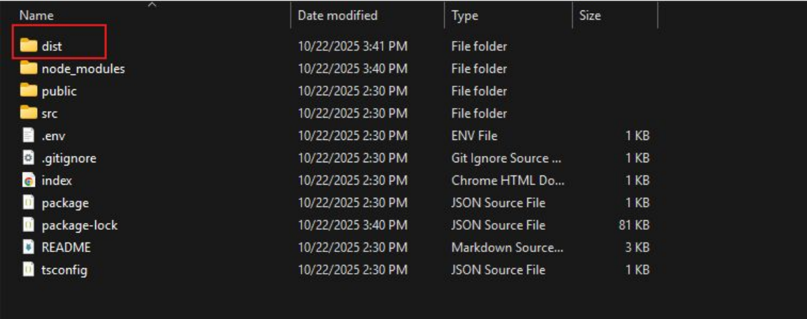  
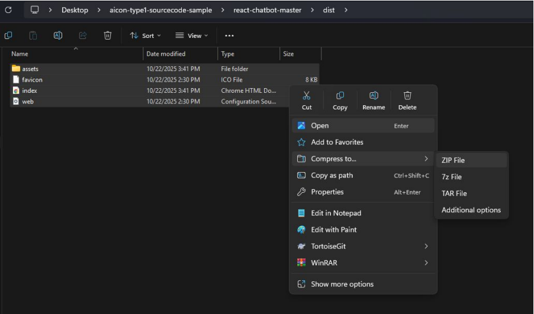

</td>
<td width="40%" valign="top" style="background-color:#f2f2f2; padding:15px; border-radius:10px;">
   
**STEP-08-3**  
**파일 압축 및 업로드**  

1. 빌드가 완료되면 react-chatbot-master\dist 디렉토리로 이동합니다.  

2. browser 폴더의 모든 내용을 ZIP 파일로 압축합니다.  

3. 압축된 파일을 AICON에 업로드합니다.  
 
</td>
</tr>
</table>

## Example Config File env React:

```

   # Provider's AI chatbot API
   VITE_API_ENDPOINT=https://api-chatbot.aicon.or.kr
   # API endpoint for KAB
   VITE_AICON_API_ENDPOINT=https://api.aicon.or.kr/api
   
   # Client ID for authentication that provided when provider registers an AI model
   VITE_CLIENT_ID=MjAyNTEwMDMwNjMzMjlfZmU3OTg0OGYxMDFjNDBhNmFlZGE3MTE4ZWY5MDJhNGY=
   
   # Client secret for authentication that provided when registers an AI model
   VITE_CLIENT_SECRET=LvMA7x0FCEKxAhKkePQDUkzDZQLPwfxal8NlLWQ0KuYXHFksVJoEzc55dFgpjDPF
   
   # Grant type for authentication
   VITE_AUTHEN_GRANT_TYPE=authorization_code
   
   # Grant type for refreshing the token
   VITE_REFRESH_GRANT_TYPE=refresh_token
   
   # Login page URL for KAB
   VITE_AICON_LOGIN=https://aicon.or.kr/auth/login

```

## STEP-09
<table>
<tr>
<td width="60%">

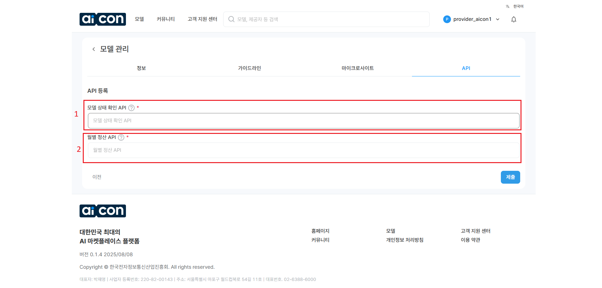 

</td>
<td width="40%" valign="top" style="background-color:#f2f2f2; padding:15px; border-radius:10px;">
   
**STEP-09**   

1. 모델 상태 확인 API 입력 (*필수)  
   [/api/Provider/is-alive](https://dev-api.aicon.or.kr/swagger/index.html)  

2. 월별 정산 API 입력  (*필수)  
   [/api/Provider/get-usage-for-settlement](https://dev-api.aicon.or.kr/swagger/index.html)

3. **‘제출’** 버튼을 클릭하여 관리자의 승인을 기다립니다.

</td>
</tr>
</table>

<h1 align="center">TYPE 2 AICON 마이크로사이트 - 채팅 타입</h1>

## STEP-01
<table>
<tr>
<td width="60%">

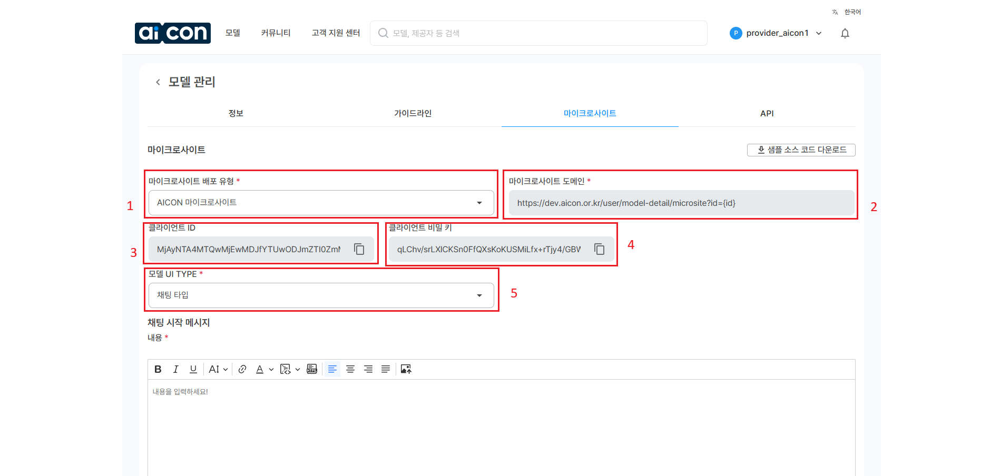 

</td>
<td width="40%" valign="top" style="background-color:#f2f2f2; padding:15px; border-radius:10px;">
   
**STEP-01**   

1. **‘마이크로사이트 배포 유형’** 드롭다운 메뉴에서 **‘AICON 마이크로사이트’** 를 선택합니다.


2. 등록이 성공하면 **‘마이크로사이트 도메인’** 형식이 표시됩니다.


3. **클라이언트 ID:** 등록된 모델의 OAuth 인증 방식을 설정하는 데 사용됩니다.


4. **클라이언트 비밀 키:** 등록된 모델의 OAuth 인증 방식을 설정하는 데 사용됩니다.

5. **모델 UI TYPE:** 채팅 타입을 선택합니다. (*필수)

</td>
</tr>
<tr>
<td width="60%">

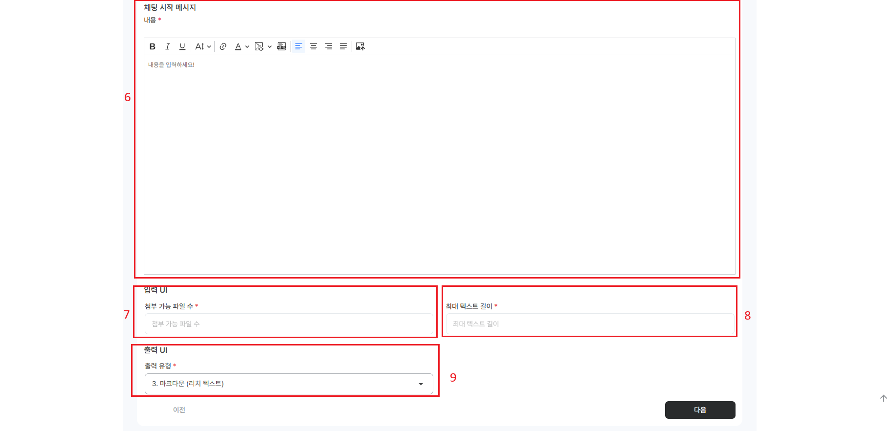 

</td>
<td width="40%" valign="top" style="background-color:#f2f2f2; padding:15px; border-radius:10px;">

6. **채팅 시작 메시지**를 입력합니다.


7. 사용자당 모델 사용 시 업로드할 수 있는 **파일 수**를 입력합니다. (*필수)


8. 사용자당 모델 사용 시 입력할 수 있는 최대 **글자 수**를 입력합니다. (*필수)


9. 모델의 ***출력 유형***을 선택합니다

</td>
</tr>
</table>

## STEP-02
<table>
<tr>
<td width="60%">

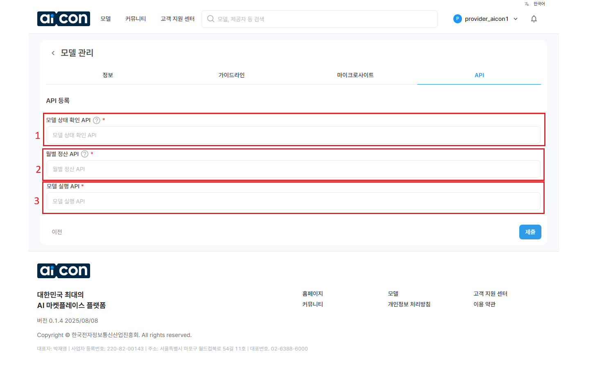 

</td>
<td width="40%" valign="top" style="background-color:#f2f2f2; padding:15px; border-radius:10px;">
   
**STEP-02**   

1. 모델 상태 확인 API 입력 (*필수)  
   [/api/Provider/is-alive](https://dev-api.aicon.or.kr/swagger/index.html)  

2. 월별 정산 API 입력  (*필수)  
   [/api/Provider/get-usage-for-settlement](https://dev-api.aicon.or.kr/swagger/index.html)

3. 모델 실행 API 입력 (*필수)
   [/api/Provider/chatting-type](https://dev-api.aicon.or.kr/swagger/index.html)

4. **‘제출’** 버튼을 클릭하여 관리자의 승인을 기다립니다.

</td>
</tr>
</table>

<h2 align="center"><a target="_blank" rel="noopener noreferrer" href="https://www.youtube.com/watch?v=IYeh-sKnXeg">📺 TYPE 2-1 - VIDEO GUIDE (채팅)</a></h2> 

---

<h1 align="center">TYPE 2 AICON 마이크로사이트 - 멀티 입력 타입</h1>

## STEP-01
<table>
<tr>
<td width="60%">

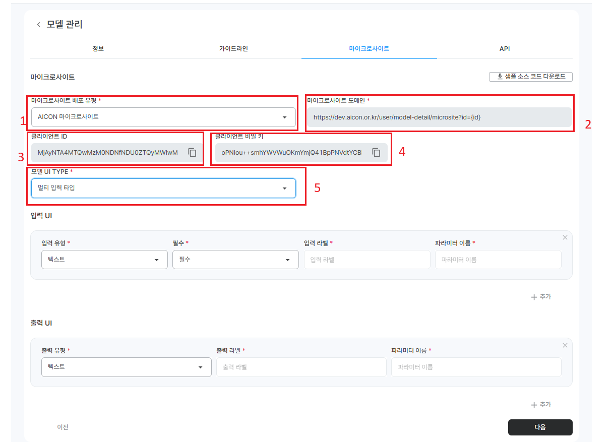 

</td>
<td width="40%" valign="top" style="background-color:#f2f2f2; padding:15px; border-radius:10px;">
   
**STEP-01**   

1. **‘마이크로사이트 배포 유형’** 드롭다운 메뉴에서 **‘AICON 마이크로사이트’** 를 선택합니다.


2. 등록이 성공하면 **‘마이크로사이트 도메인’** 형식이 표시됩니다.


3. **클라이언트 ID:** 등록된 모델의 OAuth 인증 방식을 설정하는 데 사용됩니다.


4. **클라이언트 비밀 키:** 등록된 모델의 OAuth 인증 방식을 설정하는 데 사용됩니다.

5. **모델 UI TYPE:** 멀티 입력 타입을 선택합니다. (*필수)

</td>
</tr>
<tr>
<td width="60%">

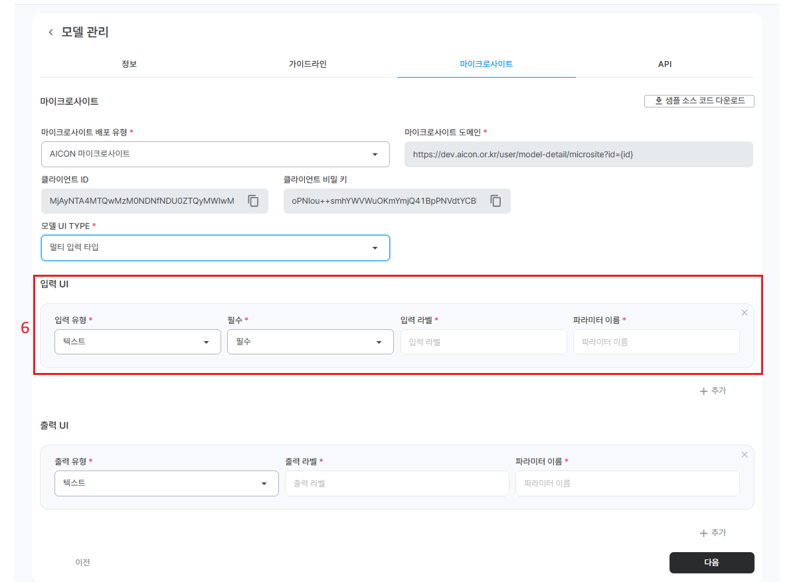 

</td>
<td width="40%" valign="top" style="background-color:#f2f2f2; padding:15px; border-radius:10px;">

6. **입력 UI:**

- **입력 유형:** 텍스트 또는 파일를 선택합니다. (*필수)

- **필수 여부:** 해당 정보 필드가 사용자 인터페이스에서 필수인지 여부를 ‘예’ 또는 ‘아니오’로 선택합니다. (*필수)

- **입력 라벨:** 사용자 인터페이스에 표시될 입력 필드의 라벨을 설정합니다. (*필수)

- **파라미터 이름:** API 요청에 맞게 이 필드를 설정합니다. API는 AICON의 형식과 설계에 따라야 하며, 예시는  
  [/api/Provider/chat-multi-input](https://dev-api.aicon.or.kr/swagger/index.html)  
  (*필수)

</td>
</tr>
<tr>
<td width="60%">

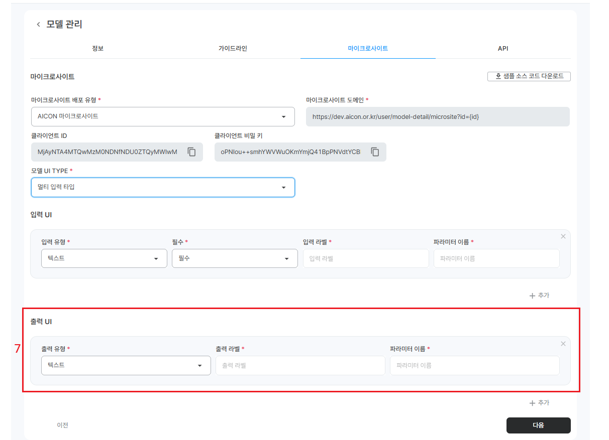 

</td>
<td width="40%" valign="top" style="background-color:#f2f2f2; padding:15px; border-radius:10px;">

7. **출력 UI:**

- **출력 유형:** 텍스트, 파일, 이미지 중 선택합니다. (*필수)

- **출력 라벨:** 사용자 인터페이스에 표시될 출력 필드의 라벨을 설정합니다. (*필수)

- **파라미터 이름:** API 응답에 맞게 이 필드를 설정합니다. API는 AICON의 형식과 설계에 따라야 하며, 예시는
  [/api/Provider/chat-multi-input](https://dev-api.aicon.or.kr/swagger/index.html)

</td>
</tr>
</table>

## STEP-02
<table>
<tr>
<td width="60%">

 

</td>
<td width="40%" valign="top" style="background-color:#f2f2f2; padding:15px; border-radius:10px;">
   
**STEP-02**   

1. 모델 상태 확인 API 입력 (*필수)  
   [/api/Provider/is-alive](https://dev-api.aicon.or.kr/swagger/index.html)  

2. 월별 정산 API 입력  (*필수)  
   [/api/Provider/get-usage-for-settlement](https://dev-api.aicon.or.kr/swagger/index.html)

3. 모델 실행 API 입력  (*필수)
   [/api/Provider/chat-multi-input](https://dev-api.aicon.or.kr/swagger/index.html)

4. **‘제출’** 버튼을 클릭하여 관리자의 승인을 기다립니다.

</td>
</tr>
</table>

<h2 align="center"><a target="_blank" rel="noopener noreferrer" href="https://www.youtube.com/watch?v=j5Yc-Z7Mcvk">📺 TYPE 2-1 - VIDEO GUIDE (멀티 입력)</a></h2> 

---

<h1 align="center">TYPE 3 OAuth 또는 API Key를 사용한 모델</h1>  

## STEP-01
<table>
<tr>
<td width="60%">

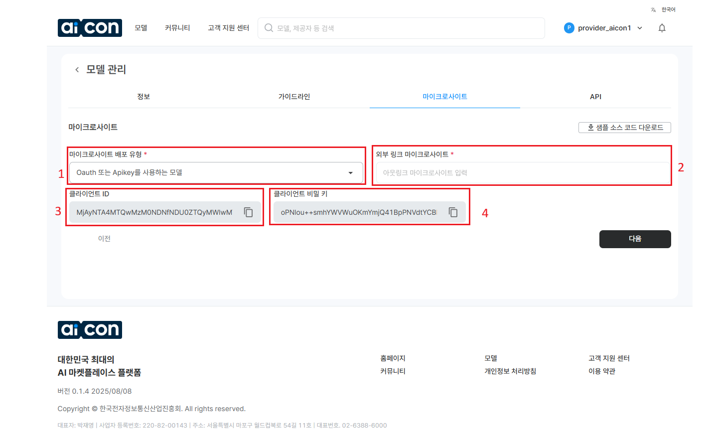 

</td>
<td width="40%" valign="top" style="background-color:#f2f2f2; padding:15px; border-radius:10px;">
   
**STEP-01**   

1. **‘마이크로사이트 배포 유형’** 드롭다운 메뉴에서 **‘OAuth 또는 API Key를 사용한 모델’** 을 선택합니다.

2. 마이크로사이트의 URL을 입력합니다. (*필수)

3. **클라이언트 ID:** 등록된 모델의 OAuth 인증 방식을 설정하는 데 사용됩니다.

4. **클라이언트 비밀 키:** 등록된 모델의 OAuth 인증 방식을 설정하는 데 사용됩니다.

</td>
</tr>
</table>

## STEP-02
<table>
<tr>
<td width="60%">

 

</td>
<td width="40%" valign="top" style="background-color:#f2f2f2; padding:15px; border-radius:10px;">
   
**STEP-02**   

1. 모델 상태 확인 API 입력 (*필수)
   [/api/Provider/is-alive](https://dev-api.aicon.or.kr/swagger/index.html)

2. 월별 정산 API 입력  (*필수)
   [/api/Provider/get-usage-for-settlement](https://dev-api.aicon.or.kr/swagger/index.html)

3. **‘제출’** 버튼을 클릭하여 관리자의 승인을 기다립니다.

</td>
</tr>
</table>

<h2 align="center"><a target="_blank" rel="noopener noreferrer" href="https://www.youtube.com/watch?v=2N9FOmNFkYE">📺 TYPE 3 - VIDEO GUIDE</a></h2>

---

<h1 align="center">TYPE 4 아웃링크</h1>

## STEP-01
<table>
<tr>
<td width="60%">

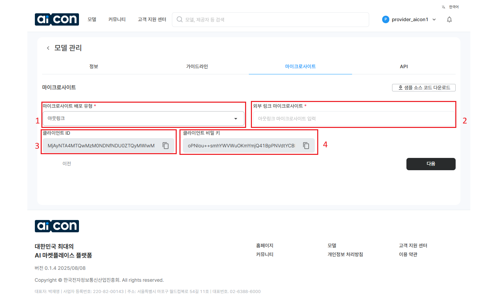 

</td>
<td width="40%" valign="top" style="background-color:#f2f2f2; padding:15px; border-radius:10px;">
   
**STEP-01**   

1. **‘마이크로사이트 배포 유형’** 드롭다운 메뉴에서 **‘아웃링크’** 를 선택합니다.

2. 마이크로사이트의 URL을 입력합니다. (*필수)

3. **클라이언트 ID:** 등록된 모델의 OAuth 인증 방식을 설정하는 데 사용됩니다.

4. **클라이언트 비밀 키:** 등록된 모델의 OAuth 인증 방식을 설정하는 데 사용됩니다.

</td>
</tr>
</table>

## STEP-02
<table>
<tr>
<td width="60%">

 

</td>
<td width="40%" valign="top" style="background-color:#f2f2f2; padding:15px; border-radius:10px;">
   
**STEP-02**   

1. 모델 상태 확인 API 입력 (*필수)
   [/api/Provider/is-alive](https://dev-api.aicon.or.kr/swagger/index.html)

2. 월별 정산 API 입력  (*필수)
   [/api/Provider/get-usage-for-settlement](https://dev-api.aicon.or.kr/swagger/index.html)

3. **‘제출’** 버튼을 클릭하여 관리자의 승인을 기다립니다.

</td>
</tr>
</table>

<h2 align="center"><a target="_blank" rel="noopener noreferrer" href="https://www.youtube.com/watch?v=ogdqd3lClng">📺 TYPE 4 - VIDEO GUIDE</a></h2>
